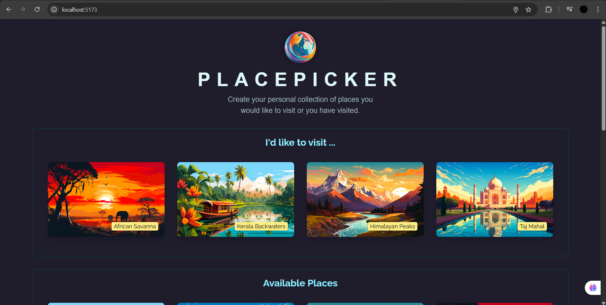
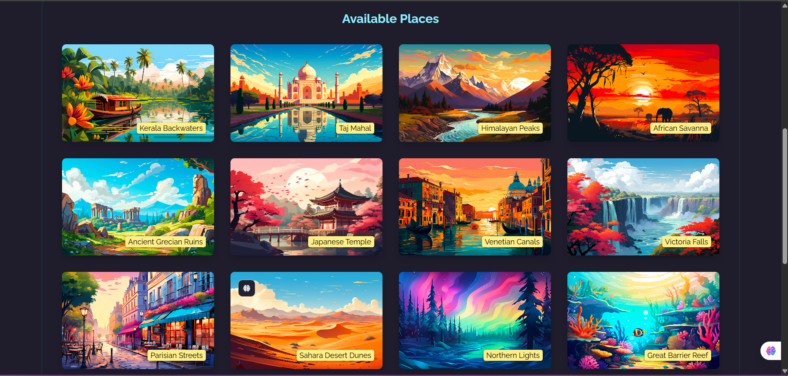

🧭 PlacePicker

A fullstack web app built with React (Vite) + Express + FS (for data persistence).
This project lets users browse available places and select their favorites — all in one clean UI.

⚙️ Tech Stack

Frontend: React (Vite)

Backend: Node.js + Express

Database: MongoDB

Runtime: npm / Node 20+

🚀 Quick Start
🖥️ Frontend (React Vite)
# open project folder
cd src

# install dependencies
npm install

# start the dev server
npm run dev

The frontend will run on http://localhost:5173

⚡ Backend (Express)
# open backend folder
cd backend

# install dependencies
npm install

# start the backend server
node app.js

If using MongoDB:

Create a .env file in /backend:

PORT=3000
MONGODB_URI=mongodb+srv://<your-uri>

🏠 Screenshots
Select a Place

Available Places

📜 License

MIT License © 2025 Deep Bahirshet

💬 Author

Built with ❤️ by Deep Bahirshet
GitHub: @DeepBahirshet
